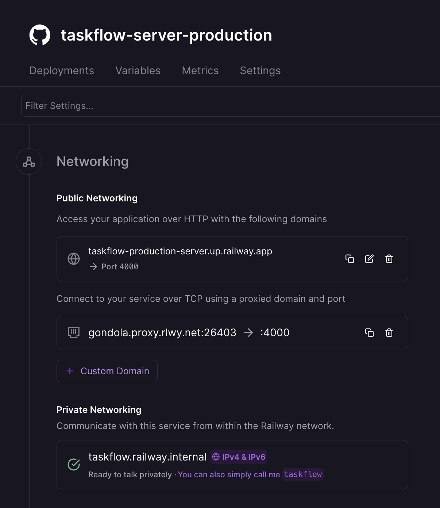
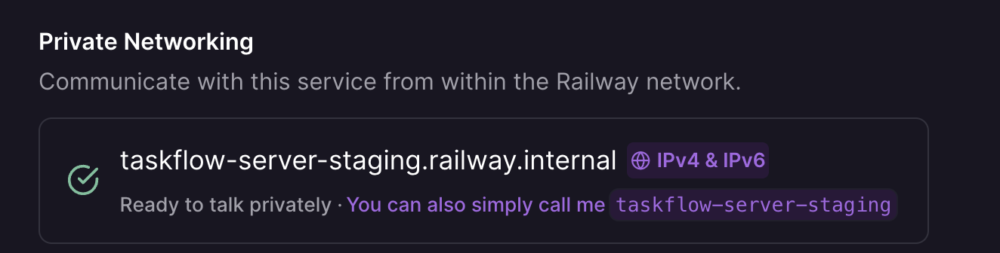

# Railway Deployment Guide

This guide covers the full end-to-end setup: Railway service configuration, secret management, and GitHub Actions CI/CD pipelines across **ci**, **staging**, and **production** environments.

---

## Architecture Overview

TaskFlow deploys as two Railway services within the same project and in a chosen environment (i.e. ci, staging or production):

| Service | Dockerfile target | Port |
|---|---|---|
| `taskflow-server` | `packages/server/Dockerfile` → `production` | 4000 |
| `taskflow-client` | `packages/client/Dockerfile` → `production` | 80 |

The client is a static React app served by nginx, which proxies `/api` requests to the server via Railway's **private networking** (`taskflow.railway.internal:4000`). No traffic between client and server leaves the Railway network.

**CI/CD pipelines** (`.github/workflows/`) trigger Railway deploys automatically:

| Workflow | Trigger | Target |
|---|---|---|
| `deploy-ci.yml` | Every merge to `main` | Railway `ci` environment |
| `deploy-staging.yml` | Manual (`workflow_dispatch`) + optional SHA | Railway `staging` environment |
| `deploy-production.yml` | Manual (`workflow_dispatch`) + reviewer approval | Railway `production` environment |

---

## Prerequisites

- A [Railway](https://railway.app) account
- Railway CLI installed: `npm install -g @railway/cli`
- The GitHub repository linked to your Railway project
- Access to the dotenv-vault decryption keys for the target environments

---

## Step 1 — Create the Railway Project

1. Go to [railway.app/new](https://railway.app/new)
2. Select **Deploy from GitHub repo** and choose `taskflow`
3. Railway will detect the repo — do **not** let it auto-deploy yet; you will configure services manually

---

## Step 2 — Understand Secret Management (dotenv-vault)

The server uses [dotenv-vault](https://dotenv.org/env-vault) to manage secrets. All environment variables — including `MONGODB_URI`, `JWT_SECRET`, `PORT`, and `NODE_ENV` — are stored __encrypted__ in `.env.vault`, which is committed to the repo and baked into the production Docker image.

At runtime, the server decrypts the vault using a single key you provide:

| Variable | Value | Set on service |
|---|---|---|
| `DOTENV_KEY` | The decryption key for the target environment | `taskflow-server` |

To get the key for an environment, run locally:

```bash
npx dotenv-vault@latest keys ci
npx dotenv-vault@latest keys staging
npx dotenv-vault@latest keys production
```

> MongoDB is hosted externally (e.g. MongoDB Atlas). Its connection string is stored encrypted inside `.env.vault` — no MongoDB add-on or separate Railway database is needed.

### Updating secrets

To rotate or update any secret (e.g. `MONGODB_URI` or `JWT_SECRET`):

1. Update the value in your local `.env.ci` or `.env.staging` or `.env.production` file
2. Run dotenv-vault push for the matching environment to re-encrypt and update `.env.vault`:

```bash
npx dotenv-vault@latest push ci
npx dotenv-vault@latest push staging
npx dotenv-vault@latest push production
```

3. Commit and push `.env.vault` — the next Railway deploy will pick up the new values automatically via the same `DOTENV_KEY`

---

## Step 3 — Configure the Server Service

### Build settings (Settings → Build)

| Field | Value |
|---|---|
| Build Command | *(leave blank — uses Dockerfile)* |
| Dockerfile Path | `packages/server/Dockerfile` |
| Docker Build Target Environment | `production` |
| Root Directory | `/` (repo root) |

### Environment variables (Variables tab)

| Variable | Value |
|---|---|
| `DOTENV_KEY` | Decryption key from `npx dotenv-vault@latest keys <env>` |
| `CLIENT_ORIGIN` | The public Railway URL of the client service, e.g. `https://taskflow-production-client.xxxx.up.railway.app` - You can rename this URL to something memorable. |
| `PORT` | `4000` |

> `DOTENV_KEY` unlocks the vault and injects all other secrets automatically (`MONGODB_URI`, `JWT_SECRET`, `NODE_ENV`). `CLIENT_ORIGIN` is set separately because it depends on the Railway-assigned client domain, which is not known at vault-build time. `PORT` must also be set explicitly — Railway's HTTP proxy reads `PORT` directly to route traffic to the container, and it cannot see values injected by dotenv-vault at boot time. Without it, Railway defaults to port 80 and the server (listening on 4000) returns 502.

### Networking (Settings → Networking)

- Click **Generate Domain** to give the server its public URL (needed for health checks and external API testing)
- Note the __Private Networking__ hostname shown — it will be `taskflow.railway.internal`. This is what the client uses to reach the server internally via `BACKEND_URL`

---

## Step 4 — Configure the Client Service

### Build settings (Settings → Build)

| Field | Value |
|---|---|
| Dockerfile Path | `packages/client/Dockerfile` |
| Docker Build Target Environment | `production` |
| Root Directory | `/` (repo root) |

### Environment variables (Variables tab)




| Variable | Value |
|---|---|
| `BACKEND_URL` | `http://taskflow.railway.internal:4000` |
| `PORT` | `80` |

> __Important:__ Use the private networking hostname (`taskflow.railway.internal`), not the public URL. This keeps traffic inside Railway's network and avoids latency and egress costs.
> The nginx startup script reads the container's DNS resolver automatically and substitutes `BACKEND_URL` at runtime — no rebuild is needed when this value changes.
> __`PORT` must be set to `80`__ — Railway uses the `PORT` variable to determine which port the container listens on. The client (nginx) listens on port 80, so without this Railway cannot route incoming traffic to the service correctly.

### Networking (Settings → Networking)

- Click **Generate Domain** to give the client its public URL
- Once generated, __go back to the server service Variables__ and set `CLIENT_ORIGIN` to this URL (needed for CORS)

---

## Step 5 — Deploy (first time)

Trigger a deploy on both services manually from the Railway dashboard. Railway will:

1. Build the Docker image from the repo root using the specified Dockerfile
2. For the __client__: nginx starts, reads `/etc/resolv.conf` for the DNS resolver, substitutes `$BACKEND_URL` into the nginx config, then serves the app
3. For the __server__: dotenv-vault decrypts `.env.vault` using `DOTENV_KEY`, injects all secrets, connects to MongoDB, and listens on port 4000

Verify by visiting the client's public URL and checking:

- The app loads (`/`)
- `GET <client-url>/api/flags` returns a JSON response (proxied through nginx to the server)

---

## Step 6 — Multiple Environments (CI, Staging and Production)

Railway supports **Environments** within a single project. Use this to maintain separate ci, staging and production deployments.

1. In your project, click **Environments** → **New Environment** → name it `ci`, `staging` and `production`.
2. Each environment gets its own set of variable values and its own deployed instances of each service
3. Set a different `DOTENV_KEY` per environment — dotenv-vault will automatically load the matching vault entry (`DOTENV_VAULT_CI`, `DOTENV_VAULT_STAGING` or `DOTENV_VAULT_PRODUCTION`), which sets `NODE_ENV` and all other env-specific values

| Environment | `DOTENV_KEY` points to | Feature flags file | Flags enabled (default + overrides) |
|---|---|---|---|
| ci | `DOTENV_VAULT_CI` | `flags.ci.json` | (2 + 5) of 9 |
| staging | `DOTENV_VAULT_STAGING` | `flags.staging.json` | (2 + 2) of 9 |
| production | `DOTENV_VAULT_PRODUCTION` | `flags.production.json` | (2 + 0) of 9 |

---

## Step 7 — GitHub Actions Setup

Subsequent deploys after the first are handled automatically by GitHub Actions. The reusable workflow (`.github/workflows/_deploy.yml`) calls the Railway CLI to trigger a deploy — no local build steps run in CI; Railway builds the Docker image itself.

### Step 7a — Create a Railway Token

1. In the Railway dashboard → your project → **Settings** → **Tokens**.
2. Select an environment from the dropdown, then click **New Token**. Copy the value.

### Step 7b — Create GitHub Environments

Go to your GitHub repo → **Settings** → **Environments** and create three environments:

| Environment | Protection rules |
|---|---|
| `ci` | None (auto-deploys on every merge to `main`) |
| `staging` | Optional protections — e.g. required reviewers and/or branch restrictions before deploy |
| `production` | **Required reviewers** — add at least one approver |

### Step 7c — Add Secrets per GitHub Environment

For each environment (`ci`, `staging`, `production`), add the following under **Secrets**:

| Secret | Value |
|---|---|
| `RAILWAY_TOKEN` | The Railway project token from Step 7a |

### Step 7d — Add Variables per GitHub Environment

For each environment, add the following under **Variables**:

| Variable | Value | Purpose |
|---|---|---|
| `SERVER_URL` | `https://taskflow-<env>-server-xxxx.up.railway.app` | Health check after deploy |
| `CLIENT_URL` | `https://taskflow-<env>-client-xxxx.up.railway.app` | PR comment and job summary link |

> Copy the exact public URLs from the Railway dashboard (the Railway-generated domains under each service's Networking settings).

### How the pipelines work

| Workflow | How to trigger | What it does |
|---|---|---|
| `deploy-ci.yml` | Automatic — every push to `main` | Deploys both services to Railway `ci` environment |
| `deploy-staging.yml` | Manual — Actions tab → Run workflow (optionally provide a SHA) | Deploys to Railway `staging`, then comments on the associated PR |
| `deploy-production.yml` | Manual — Actions tab → Run workflow → waits for reviewer approval | Deploys to Railway `production`, then creates a GitHub Release |

---

## Troubleshooting

### 502 Bad Gateway on `/api` routes

nginx can't reach the server. Check in order:

1. __Wrong hostname__ — Go to the server service → Settings → Networking and confirm the private hostname. Set `BACKEND_URL` on the client to `http://<private-hostname>:4000`
2. **Different Railway environments** — Private networking only works between services in the **same environment**. Ensure both client and server are deployed in the same Railway environment
3. __Server not running__ — Check the server's Deploy Logs for startup errors (bad `DOTENV_KEY`, MongoDB connection failure, etc.)

### `host not found in upstream` on nginx startup

The `BACKEND_URL` variable is not set or is empty in the client service. Confirm the variable exists under the client's Variables tab and redeploy.

### `invalid port in resolver` on nginx startup

The container's DNS server is an IPv6 address and wasn't wrapped in brackets. This is handled automatically by the Dockerfile CMD — if you see this error it means the image was not rebuilt after the latest Dockerfile change. Force a redeploy.

### CORS errors in the browser

The `CLIENT_ORIGIN` variable on the server does not match the client's public URL. Update it to the exact origin (scheme + hostname, no trailing slash) and redeploy the server.

### MongoDB connection failures

The `DOTENV_KEY` is incorrect or points to the wrong environment, so `MONGODB_URI` is not being injected. Verify the key with `npx dotenv-vault@latest keys <env>` and confirm it matches what is set in Railway.

### GitHub Actions deploy fails with `unauthorized`

The `RAILWAY_TOKEN` secret is missing, expired, or scoped to the wrong project. Regenerate it from Railway → Settings → Tokens and update the secret in the relevant GitHub Environment.
